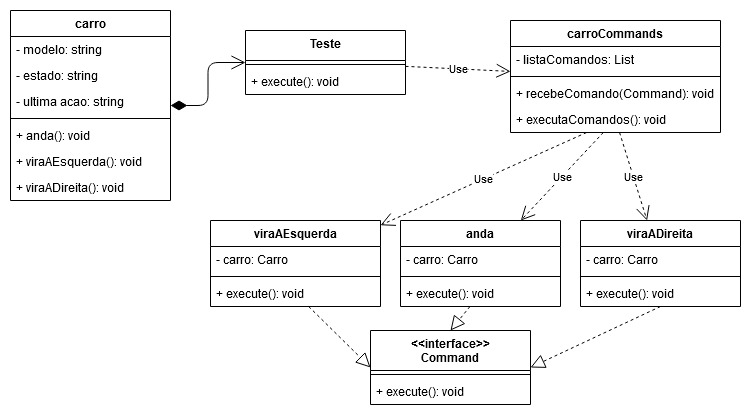

# Métodos Avançados de Programação

## UNIESP Faculdades

### Professora

* Drª Alana Morais ([alanamm.prof@gmail.com](mailto:alanamm.prof@gmail.com))

### Aluno
* Williams José de Aguiar Silva ([contatowilliamsj@gmail.com](mailto:contatowilliamsj@gmail.com?subject=[GitHub]%20Command%20Pattern))

### Padrão Comportamental: 
> O Command é um padrão de projeto comportamental que transforma um pedido em um objeto independente que contém toda a informação sobre o pedido. Essa transformação permite que você parametrize métodos com diferentes pedidos, atrase ou coloque a execução do pedido em uma fila, e suporte operações que não podem ser feitas.

## Padrão Command

### Problema: 
> As vezes é necessário emitir solicitações para objetos sem saber sobre a operação que está sendo solicitada ou quem é o receptor. Imagine o seguinte: um objeto GUI chama um método da lógica do negócio, passando alguns argumentos. Este processo é geralmente descrito como um objeto mandando um pedido para outro.

> Não demora muito e você percebe que essa abordagem é falha. Primeiro você tem um enorme número de subclasses, e isso seria okay se você não arriscasse quebrar o código dentro dessas subclasses cada vez que você modificar a classe base. Colocando em miúdos: seu código GUI se torna absurdamente dependente de um código volátil da lógica do negócio.

### Solução: 

> O padrão Command sugere que os objetos GUI não enviem esses pedidos diretamente. Ao invés disso, você deve extrair todos os detalhes do pedido, tais como o objeto a ser chamado, o nome do método, e a lista de argumentos em uma classe comando separada que tem apenas um método que aciona esse pedido.

> Objetos comando servem como links entre vários objetos GUI e de lógica de negócio. De agora em diante, o objeto GUI não precisa saber qual objeto de lógica do negócio irá receber o pedido e como ele vai ser processado. O objeto GUI deve acionar o comando, que irá lidar com todos os detalhes.

### Consequências: 

* Desacopla o objeto que invoca a operação do que sabe realizá-la.
* Comandos são objetos de **primeira classe**.
* Comandos podem ser reunidos para fazer comandos compostos.
* Facilidade em adicionar novos comandos.
* Enfileirar, Especificar e Executar requisições em diferentes momentos.

### Exemplo: 

[Source files](src)

### Referências:
[Refactoring.guru](https://refactoring.guru/pt-br/design-patterns/command)
